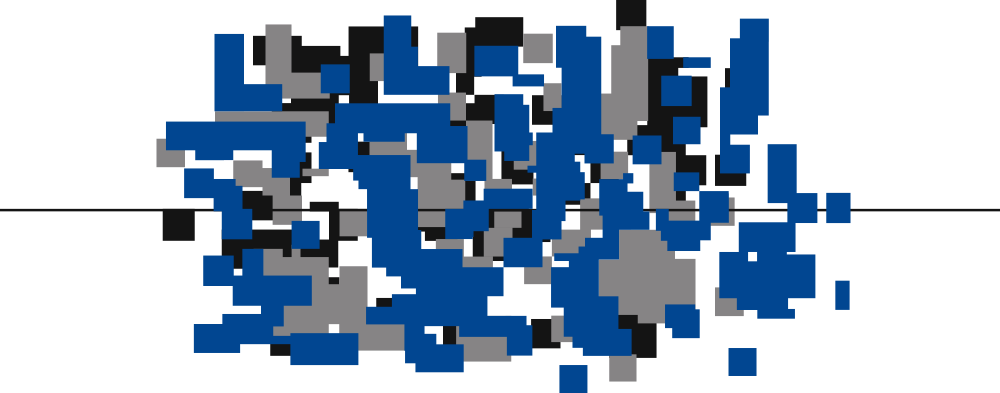

```{r}
#| label: setup
#| include: false

library(here)

here("R", ".setup.R") |> source()
```

## Overview {.first-h2}

::: {}
{width="120" style="float: right; margin-left: 1.5rem; margin-top: 0.25rem;"}

This website hosts [PMTiles](https://docs.protomaps.com/pmtiles/) files for spatial visualization and analysis in Brazil.

PMTiles is a format for storing and serving tiled geospatial data. It is designed to be efficient, scalable, and easy to use, making it ideal for web applications and data visualization.

Learn more about PMTiles and how to use them in the following sections.
:::

::: {.callout-note}
The map below shows Brazil municipality boundaries as PMTiles, sourced from the [`geobr`](https://ipeagit.github.io/geobr/) R package [@pereirab].
:::

::: {.callout-tip}
*Click and drag* to pan. *Right-click and drag* to rotate. *Hover* over a shape to see the municipality name. *Use the controls* to zoom, take a screenshot, or view in fullscreen.
:::

```{r}
#| label: Set the Environment
#| include: false

library(brandr)
library(checkmate)
library(cli)
library(dplyr)
library(fs)
library(geobr)
library(geodata)
library(h3jsr)
library(here)
library(httr2)
library(magrittr)
library(mapgl)
library(pmtiles) # github.com/walkerke/pmtiles
library(purrr)
library(sf)
library(tidyr)
```

```{r}
#| include: false

here("R", "plot_maplibre.R") |> source()
```

```{r}
#| include: false

raw_data_dir <- here("data-raw")
```

```{r}
#| include: false

if (!dir_exists(raw_data_dir)) {
  dir_create(raw_data_dir, recurse = TRUE)
}
```

```{r}
#| label: Column Screen
#| include: false

file <- file.path(
  "https://tiles.pmtiles.com.br",
  "geobr",
  "read_municipality",
  paste0(
    # fmt: skip
    paste(
      "code", "all",
      "year", 2024,
      "simplified", TRUE,
      "min_zoom", 2,
      "max_zoom", 10,
      sep = "-"
    ),
    ".pmtiles"
  )
)
```

```{r}
#| include: false

municipality_data <- read_municipality(
  year = 2024,
  simplified = TRUE,
  showProgress = FALSE
)
```

```{r}
#| include: false

municipality_data |> glimpse()
```

```{r}
#| column: screen
#| echo: false

file |>
  plot_maplibre(
    column = "code_muni",
    values = municipality_data |>
      pull("code_muni"),
    tooltip = "name_muni",
    hover_options = list(
      fill_color = get_brand_color("gray-l50"),
      fill_opacity = 1
    ),
    line_width = 0.01,
    scrollZoom = FALSE,
    seed = 1998
  )
```

## Why Use PMTiles?

When working with complex geometries in web mapping applications like [Mapbox](https://www.mapbox.com/), [MapLibre](https://maplibre.org/), and [Leaflet](https://leafletjs.com/), performance can become [a real problem](https://walker-data.com/posts/pmtiles-texas-blocks/). Shapes with many vertices make rendering slow, bloat file sizes, and generally make life harder. [PMTiles](https://docs.protomaps.com/pmtiles/) addresses this by letting you serve precompiled tiles directly from the web, rather than bundling them into your application.

## Collections {#collections-1}

PMTilesBR includes several collections of [PMTiles](https://docs.protomaps.com/pmtiles/) files sourced from popular geospatial [R](https://www.r-project.org/) packages. Below is an overview of each one:

::: {.callout-note}
See the [*Usage*](#usage) section for instructions on how to access and use the PMTiles files.
:::

::: {.callout-important}
Not all parameter combinations may be available. Refer to [`pmtiles.yaml`](https://github.com/cem-usp/pmtilesbr/blob/main/pmtiles.yaml){target="_blank"} for the full list of available PMTiles files.
:::

::: {.callout-tip}
Unless you really need to, use the simplified versions of the files, which are smaller and faster to load. The non-simplified versions are available for those who need the highest level of detail, but they may not be necessary for most applications.
:::

::: {.panel-tabset .map-tabset}

## `geobr::read_municipality`

Sourced from the [`geobr`](https://ipeagit.github.io/geobr/) R package [@pereirab].

#### Parameters

- Code: `"all"` (for all municipalities) or a specific municipality code (e.g., 3550308 for São Paulo)
- Year: 1872-2024
- Simplified: `TRUE`/`FALSE`
- Minimum Zoom: 0-22
- Maximum Zoom: 0-22

#### View

```{r}
#| label: geobr::read_municipality()
#| include: false

file <- file.path(
  "https://tiles.pmtiles.com.br",
  "geobr",
  "read_municipality",
  paste0(
    # fmt: skip
    paste(
      "code", "all",
      "year", 2024,
      "simplified", TRUE,
      "min_zoom", 2,
      "max_zoom", 10,
      sep = "-"
    ),
    ".pmtiles"
  )
)
```

**File**: `r paste0("<", file, ">")`

```{r}
#| include: false
#| eval: false

file |> pm_show(tilejson = TRUE)
```

```{r}
#| eval: false
#| include: false

municipality_data <- read_municipality(
  year = 2024,
  simplified = TRUE,
  showProgress = FALSE
)
```

```{r}
#| include: false

municipality_data |> glimpse()
```

```{r}
#| echo: false

file |>
  plot_maplibre(
    column = "code_muni",
    values = municipality_data |>
      pull("code_muni"),
    tooltip = "name_muni",
    hover_options = list(
      fill_color = get_brand_color("gray-l50"),
      fill_opacity = 1
    ),
    line_width = 0.01,
    seed = 1998
  )
```

#### H3 Grids

This collection also counts with PMTiles files that were processed with the [h3jsr](https://obrl-soil.github.io/h3jsr/) R package [@obrien2023], which converts spatial data into [H3 grids](https://h3geo.org/) [@uber]. These files have an additional `res` parameter that indicates the [H3 resolution](https://h3geo.org/docs/core-library/restable/#cell-counts) used for processing. The higher the resolution, the more detailed the grid will be, but also the larger the file size and the slower the rendering.

To use this version of the files, add `h3jsr` and `res` parameters to the URL. For example, to access the H3 version of the file with municipality code 3550308, year 2024, without simplified geometries, zoom levels 2-10, and H3 resolution 9, the URL would be:

```{r}
#| include: false

file <- file.path(
  "https://tiles.pmtiles.com.br",
  "geobr",
  "read_municipality",
  "h3jsr",
  "res-9",
  paste0(
    # fmt: skip
    paste(
      "code", 3550308,
      "year", 2024,
      "simplified", FALSE,
      "min_zoom", 2,
      "max_zoom", 10,
      sep = "-"
    ),
    ".pmtiles"
  )
)
```

**File**: `r paste0("<", file, ">")`

::: {.callout-note}
If you're seeing missing hexagons when using these files, it's likely you are trying to match a [H3](https://h3geo.org/) grid made with a simplified geometry with an H3 grid made with a non-simplified geometry. To fix this, make sure to use the same value for the `simplified` parameter in both the source function and the PMTiles file.
:::

```{r}
#| include: false
#| eval: false

file |> pm_show(tilejson = TRUE)
```

```{r}
#| include: false

municipality_data <- read_municipality(
  code_muni = 3550308,
  year = 2024,
  simplified = FALSE,
  showProgress = FALSE
) |>
  st_transform(crs = 4326) |>
  polygon_to_cells(res = 9, simple = FALSE) |>
  st_drop_geometry() |>
  unnest(h3_addresses) |>
  relocate(h3_addresses) |>
  cell_to_polygon(simple = FALSE) |>
  relocate(h3_address) |>
  st_as_sf()
```

```{r}
#| include: false

municipality_data |> glimpse()
```

```{r}
#| echo: false

file |>
  plot_maplibre(
    column = "h3_address",
    values = municipality_data |>
      pull("h3_address"),
    tooltip = "h3_address",
    hover_options = list(
      fill_color = get_brand_color("gray-l50"),
      fill_opacity = 1
    ),
    line_width = 0.001,
    seed = 1998
  )
```

## `geobr::read_state`

Sourced from the [`geobr`](https://ipeagit.github.io/geobr/) R package [@pereirab].

#### Parameters

- Year: 1872-2020
- Code: `"all"` (for all states) or a specific state code (e.g., 35 for São Paulo)
- Simplified: `TRUE`/`FALSE`
- Minimum Zoom: 0-22
- Maximum Zoom: 0-22

#### View

```{r}
#| label: geobr::read_state()
#| include: false

file <- file.path(
  "https://tiles.pmtiles.com.br",
  "geobr",
  "read_state",
  paste0(
    # fmt: skip
    paste(
      "code", "all",
      "year", 2020,
      "simplified", TRUE,
      "min_zoom", 2,
      "max_zoom", 10,
      sep = "-"
    ),
    ".pmtiles"
  )
)
```

**File**: `r paste0("<", file, ">")`

```{r}
#| include: false
#| eval: false

file |> pm_show(tilejson = TRUE)
```

```{r}
#| include: false

state_data <- read_state(
  year = 2020,
  simplified = TRUE,
  showProgress = FALSE
)
```

```{r}
#| include: false

state_data |> glimpse()
```

```{r}
#| echo: false

file |>
  plot_maplibre(
    column = "code_state",
    values = state_data |>
      pull("code_state"),
    tooltip = "name_state",
    hover_options = list(
      fill_color = get_brand_color("gray-l50"),
      fill_opacity = 1
    ),
    line_width = 1,
    seed = 2000
  )
```

## `geobr::read_region`

Sourced from the [`geobr`](https://ipeagit.github.io/geobr/) R package [@pereirab].

#### Parameters

- Year: 2000-2020
- Simplified: `TRUE`/`FALSE`
- Minimum Zoom: 0-22
- Maximum Zoom: 0-22

#### View

```{r}
#| label: geobr::read_region()
#| include: false

file <- file.path(
  "https://tiles.pmtiles.com.br",
  "geobr",
  "read_region",
  paste0(
    # fmt: skip
    paste(
      "year", 2020,
      "simplified", TRUE,
      "min_zoom", 2,
      "max_zoom", 10,
      sep = "-"
    ),
    ".pmtiles"
  )
)
```

**File**: `r paste0("<", file, ">")`

```{r}
#| include: false
#| eval: false

file |> pm_show(tilejson = TRUE)
```

```{r}
#| include: false

region_data <- read_region(
  year = 2020,
  simplified = TRUE,
  showProgress = FALSE
)
```

```{r}
#| include: false

region_data |> glimpse()
```

```{r}
#| echo: false

file |>
  plot_maplibre(
    column = "code_region",
    values = region_data |>
      pull("code_region"),
    tooltip = "name_region_en",
    hover_options = list(
      fill_color = get_brand_color("gray-l50"),
      fill_opacity = 1
    ),
    line_width = 1,
    seed = 2013
  )
```

## `geobr::read_country`

Sourced from the [`geobr`](https://ipeagit.github.io/geobr/) R package [@pereirab].

#### Parameters

- Years: 1872-2020
- Simplified: `TRUE`/`FALSE`
- Minimum Zoom: 0-22
- Maximum Zoom: 0-22

#### View

```{r}
#| label: geobr::read_country()
#| include: false

file <- file.path(
  "https://tiles.pmtiles.com.br",
  "geobr",
  "read_country",
  paste0(
    # fmt: skip
    paste(
      "year", 2020,
      "simplified", "TRUE",
      "min_zoom", 2,
      "max_zoom", 10,
      sep = "-"
    ),
    ".pmtiles"
  )
)
```

**File**: `r paste0("<", file, ">")`

```{r}
#| include: false
#| eval: false

file |> pm_show(tilejson = TRUE)
```

```{r}
#| echo: false

file |>
  plot_maplibre(
    column = "code_muni",
    fill_color = get_brand_color("red"),
    line_width = 1
  )
```

## `geodata::gadm`

Sourced from the [`geodata`](https://rspatial.github.io/geodata/) R package [@hijmans2024].

#### Parameters

- Country: [ISO 3166-1 alpha-3](https://en.wikipedia.org/wiki/ISO_3166-1_alpha-3) standard (e.g., `BRA`, `ITA`, or `USA`)
- Level: 0-1
- Version: `"latest"`/`"4.1"`/`"4.0"`/`"3.6"`
- Resolution: 1-2
- Minimum Zoom: 0-22
- Maximum Zoom: 0-22

#### View

```{r}
#| label: geodata::gadm()
#| include: false

file <- file.path(
  "https://tiles.pmtiles.com.br",
  "geodata",
  "gadm",
  paste0(
    # fmt: skip
    paste(
      "country", "ARM",
      "level", 0,
      "version", "latest",
      "resolution", 1,
      "min_zoom", "2",
      "max_zoom", "10",
      sep = "-"
    ),
    ".pmtiles"
  )
)
```

**File**: `r paste0("<", file, ">")`

```{r}
#| include: false
#| eval: false

file |> pm_show(tilejson = TRUE)
```

```{r}
#| include: false

country_data <- gadm(
  country = "ARM",
  level = 0,
  path = raw_data_dir,
  version = "latest",
  resolution = 1
) |>
  st_as_sf()
```

```{r}
#| include: false

country_data |> glimpse()
```

```{r}
#| echo: false

file |>
  plot_maplibre(
    column = "GID_0",
    values = country_data |>
      pull("GID_0"),
    tooltip = "COUNTRY",
  )
```

## `geodata::world`

Sourced from the [`geodata`](https://rspatial.github.io/geodata/) R package [@hijmans2024].

#### Parameters

- Level: 0
- Version: `"latest"`/`"3.6"`
- Resolution: 1-5
- Minimum Zoom: 0-22
- Maximum Zoom: 0-22

The `resolution` parameter always comes after `version`, to match with the [`gadm()`](https://rspatial.github.io/geodata/reference/gadm.html) function.

#### View

```{r}
#| label: geodata::world()
#| include: false

file <- file.path(
  "https://tiles.pmtiles.com.br",
  "geodata",
  "world",
  paste0(
    # fmt: skip
    paste(
      "level", 0,
      "version", "latest",
      "resolution", 5,
      "min_zoom", 0,
      "max_zoom", 6,
      sep = "-"
    ),
    ".pmtiles"
  )
)
```

**File**: `r paste0("<", file, ">")`

```{r}
#| include: false
#| eval: false

file |> pm_show(tilejson = TRUE)
```

```{r}
#| include: false

world_data <- world(
  resolution = 5,
  level = 0,
  path = raw_data_dir,
  version = "latest"
) |>
  st_as_sf()
```

```{r}
#| include: false

world_data |> glimpse()
```

```{r}
#| echo: false

file |>
  plot_maplibre(
    column = "GID_0",
    values = world_data |>
      pull("GID_0"),
    bounds = c(-175, -75, 180, 85),
    tooltip = "NAME_0",
    hover_options = list(
      fill_color = get_brand_color("gray-l50"),
      fill_opacity = 1
    ),
    line_width = 0.5
  )
```

:::

## Usage

All files are hosted at `https://tiles.pmtiles.com.br` and follow a consistent URL structure based on the collection, source function, parameters, and zoom levels. The sections below cover how to access the files, inspect their metadata, and use them in your applications.

For a complete list of available PMTiles files and their metadata, see [`pmtiles.yaml`](https://github.com/cem-usp/pmtilesbr/blob/main/pmtiles.yaml){target="_blank"}.

### Collections {#collections-2}

PMTilesBR have different collections of tiles for you to choose. These collections are typically sourced from popular R packages for geospatial data, such as [`geobr`](https://ipeagit.github.io/geobr/) [@pereirab] and [`geodata`](https://rspatial.github.io/geodata/) [@hijmans2024]. Each collection has its own set of parameters that you can use to get the specific tiles you need. See the [*Collections*](#collections-1) section to learn more.

### Patterns

To access the PMTiles files, construct a URL following this naming pattern:

```
https://tiles.pmtiles.com.br/
├─ {collection}/
    ├─ {function}/
        ├─ {parameters-values}-{min_zoom-value}-{max_zoom-value}.pmtiles
```

Where:

- `collection`: The data collection name, typically the source R package (e.g., [`geobr`](https://ipeagit.github.io/geobr/)).
- `function`: The function used to source the data (e.g., [`read_municipality()`](https://ipeagit.github.io/geobr/reference/read_municipality.html)).
- `parameters-values`: The parameter names and values passed to the function.
- `min_zoom-value`: The minimum [zoom level](https://github.com/felt/tippecanoe#zoom-levels).
- `max_zoom-value`: The maximum [zoom level](https://github.com/felt/tippecanoe#zoom-levels).

All files include `min_zoom` and `max_zoom` in their names. Unlisted parameters use their default values.

For example, a file from the [`geobr`](https://ipeagit.github.io/geobr/) package using [`read_municipality()`](https://ipeagit.github.io/geobr/reference/read_municipality.html) with municipality code 3550308, year 2024, simplified geometries, and zoom levels 2-10 would be:

<https://tiles.pmtiles.com.br/geobr/read_municipality/code-3550308-year-2024-simplified-TRUE-min_zoom-2-max_zoom-10.pmtiles>

::: {.callout-tip}
Use [pmtiles.io](https://pmtiles.io/#url=https://tiles.pmtiles.com.br/geobr/read_municipality/code-3550308-year-2024-simplified-TRUE-min_zoom-2-max_zoom-10.pmtiles){target="_blank"} to easily inspect each PMTiles file before using.
:::

### Example

The simplest way to load a PMTiles file is to pass its URL directly to your application. Here is an example using [R](https://www.r-project.org/) and the [`mapgl`](https://walker-data.com/mapgl/) package [@walker2026a]:

```{r}
library(dplyr)
library(geobr)
library(mapgl)
library(pmtiles) # github.com/walkerke/pmtiles
library(purrr)
```

```{r}
code <- "all"
year <- 2020
simplified <- TRUE
min_zoom <- 2
max_zoom <- 10
```

```{r}
pmtiles_file <- file.path(
  "https://tiles.pmtiles.com.br",
  "geobr",
  "read_state",
  paste0(
    # fmt: skip
    paste(
      "code", code,
      "year", year,
      "simplified", simplified,
      "min_zoom", min_zoom,
      "max_zoom", max_zoom,
      sep = "-"
    ),
    ".pmtiles"
  )
)
```

```{r}
pmtiles_layer <-
  pmtiles_file |>
  pm_show(tilejson = TRUE) |>
  pluck("vector_layers", 1, "id")
```

```{r}
#| output: false

state_data <-
  code |>
  read_state(
    year = year,
    simplified = simplified
  ) |>
  filter(
    # MG, ES, RJ, SP
    code_state %in% c(31, 32, 33, 35)
  )
```

```{r}
scale_fill_mapgl <- match_expr(
  column = "code_state",
  values = state_data |>
    pull(code_state),
  stops = c(
    "#efd46a", # MG
    "#db5025", # ES
    "#070808", # RJ
    "#db5025" # SP
  ),
  default = "#868489"
)
```

```{r}
maplibre(
  # c(xmin, ymin, xmax, ymax)
  bounds = c(-51.0, -26, -39.6, -13.5),
  projection = "mercator",
) |>
  add_pmtiles_source(
    id = "state_boundaries",
    url = pmtiles_file,
    source_type = "vector"
  ) |>
  add_fill_layer(
    id = "fill",
    source = "state_boundaries",
    source_layer = pmtiles_layer,
    fill_color = scale_fill_mapgl,
    tooltip = "name_state",
    hover_options = list(
      fill_color = get_brand_color("gray-l50"),
      fill_opacity = 1
    ),
    # fmt: skip
    filter = list(
      "in",
      list("get", "code_state"),
      list("literal", list(35, 33, 31, 32))
    )
  ) |>
  add_line_layer(
    id = "outline",
    source = "state_boundaries",
    source_layer = pmtiles_layer,
    line_color = "white",
    line_width = 1
  )
```

### H3 Grids

Some collections also include files with geometries indexed using the [h3jsr](https://obrl-soil.github.io/h3jsr/) R package [@obrien2023], which converts spatial data into [H3 hexagonal grids](https://h3geo.org/) [@uber]. These files include additional parameters in their URLs, such as the H3 resolution level. See `geobr::read_municipality` in the [*Collections*](#collections-1) section for examples and details.

### Metadata

One way to check for a PMTiles file metadata is to use the [`pm_show()`](https://walkerke.r-universe.dev/pmtiles/doc/manual.html#pm_show) function from the [`pmtiles`](https://github.com/walkerke/pmtiles) R package [@walker2025]. This function retrieves the metadata of a PMTiles file, including the bounds, zoom levels, and the fields available. Here is an example:

```{r}
library(pmtiles)
library(purrr)
```

```{r}
file <- file.path(
  "https://tiles.pmtiles.com.br",
  "geobr",
  "read_municipality",
  paste0(
    # fmt: skip
    paste(
      "code", 3550308,
      "year", 2024,
      "simplified", TRUE,
      "min_zoom", 2,
      "max_zoom", 10,
      sep = "-"
    ),
    ".pmtiles"
  )
)
```

```{r}
file |>
  pm_show(tilejson = TRUE) |>
  pluck("vector_layers", 1, "fields")
```

The PMTiles [layer id](https://walker-data.com/mapgl/reference/add_pmtiles_source.html#:~:text=id,-A) is always the name of the source function.

```{r}
file |>
  pm_show(tilejson = TRUE) |>
  pluck("vector_layers", 1, "id")
```

### Questions and Requests

If you have any questions about the data, how to use it, or if you want to request a specific PMTiles file, please visit the [Discussions](https://github.com/cem-usp/pmtilesbr/discussions){target="_blank"} tab of the project code repository. We will do our best to assist you and consider your requests for future updates.

## Citation

::: {.callout-important}
When using this data, you must also cite the original data sources.
:::

To cite this work, please use the following format:

Vartanian, D., Fernandes, C. N., & Giannotti, M. A. (2026). *PMTilesBR: Tiled geospatial data for Brazil* \[Computer software\]. Center for Metropolitan Studies, University of São Paulo. <https://doi.org/10.5281/zenodo.19157888>

A BibLaTeX entry for LaTeX users is:

```latex
@software{vartanian2026,
  title = {PMTilesBR: Tiled geospatial data for Brazil},
  author = {{Daniel Vartanian} and {Camila Nastari Fernandes} and {Mariana Abrantes Giannotti}},
  year = {2026},
  address = {São Paulo},
  institution = {Center for Metropolitan Studies, University of São Paulo},
  langid = {en},
  doi = {https://doi.org/10.5281/zenodo.19157888}
}
```

## License

::: {style="text-align: left;"}
[](https://www.gnu.org/licenses/gpl-3.0)
[](https://creativecommons.org/licenses/by-nc-sa/4.0/)
:::

::: {.callout-important}
The original data sources may be subject to their own licensing terms and conditions.
:::

The code in this website is licensed under the [GNU General Public License Version 3](https://www.gnu.org/licenses/gpl-3.0). All PMTiles files are released under the [Creative Commons Attribution-NonCommercial-ShareAlike 4.0 International](https://creativecommons.org/licenses/by-nc-sa/4.0/) license.

```
Copyright (C) 2026 Center for Metropolitan Studies

The code in this website is free software: you can redistribute it and/or
modify it under the terms of the GNU General Public License as published by the
Free Software Foundation, either version 3 of the License, or (at your option)
any later version.

This program is distributed in the hope that it will be useful, but WITHOUT ANY
WARRANTY; without even the implied warranty of MERCHANTABILITY or FITNESS FOR A
PARTICULAR PURPOSE. See the GNU General Public License for more details.

You should have received a copy of the GNU General Public License along with
this program. If not, see <https://www.gnu.org/licenses/>.
```

## Acknowledgments

:::: {.columns style="display: flex; align-items: center; margin: 1em; padding-top: 0em;"}
::: {.column style="width: 30%; text-align: center;"}
[{width="190"}](https://centrodametropole.fflch.usp.br)
:::
::: {.column style="width: 70%; display: flex; align-items: center;"}
This work was developed with support from the Center for Metropolitan Studies ([CEM](https://centrodametropole.fflch.usp.br)) based at the School of Philosophy, Letters and Human Sciences ([FFLCH](https://www.fflch.usp.br/)) of the University of São Paulo ([USP](https://usp.br/)) and at the Brazilian Center for Analysis and Planning ([CEBRAP](https://cebrap.org.br/)).
:::
::::

:::: {.columns style="display: flex; align-items: center; margin: 1em; padding-top: 0em;"}
::: {.column style="width: 30%; text-align: center;"}
[{width="160"}](https://fapesp.br/)
:::
::: {.column style="width: 70%; display: flex; align-items: center;"}
This study was financed, in part, by the São Paulo Research Foundation ([FAPESP](https://fapesp.br/)), Brazil. Process Number [2025/17879-2](https://bv.fapesp.br/en/bolsas/231507/geospatial-data-science-applied-to-food-policies/).
:::
::::

## References {.unnumbered}

::: {#refs}
:::
